<p align="center">
  
</p>


A tiny external status display for a ZimaBlade / ZimaBoard: a Python
collector reads vital stats and streams them over USB serial to an
ESP32-S3, which draws them on a small LCD. Packaged as a one-click ZimaOS
app that also hosts a browser settings dashboard and a WebSerial firmware
flasher -- no toolchain needed to set up the ESP32-S3.

##  Hardware: one firmware, two boards

The same firmware supports both boards; which one you have is chosen in
the settings, not at compile time:

- **Board 0 -- Waveshare ESP32-S3-LCD-1.3**: square 240x240, ST7789V2,
  no touchscreen. Pages auto-cycle on a timer (or show a single page).
- **Board 1 -- Waveshare ESP32-S3-Touch-LCD-1.69**: 240x280 (taller than
  wide), ST7789V2, CST816T touch. Swipe between pages, with optional
  auto-cycle on top.

**One build setting differs**: board 1 uses the ESP32-S3's native USB
(no UART bridge chip), so it needs **USB CDC On Boot: Enabled** in
Arduino IDE -- the opposite of board 0. This is compile-time, which is
why CI builds two binaries (see `firmware/platformio.ini`); everything
else is runtime config.

##  The two web pages

- **`wizard.html`** -- first-time setup: pick your board, flash the
  firmware, send the initial settings. Works two ways: through your
  browser via WebSerial (board plugged into your computer, use the
  HTTPS port), or fully server-side (board plugged into the
  ZimaBlade itself, plain HTTP is fine).
- **`dashboard.html`** -- the daily driver: General (device status, app
  updates, debugging, HTTPS certificate), Layouts (choose each page's
  look with live previews), Screen (brightness, rotation, aspect
  ratio -- including a 1.3" compact mode for 240x280 panels behind
  smaller cutouts -- night mode, and a screensaver with four styles:
  drifting clock, temperature, hostname & IP, or screen off), and
  About.

<p align="center">
  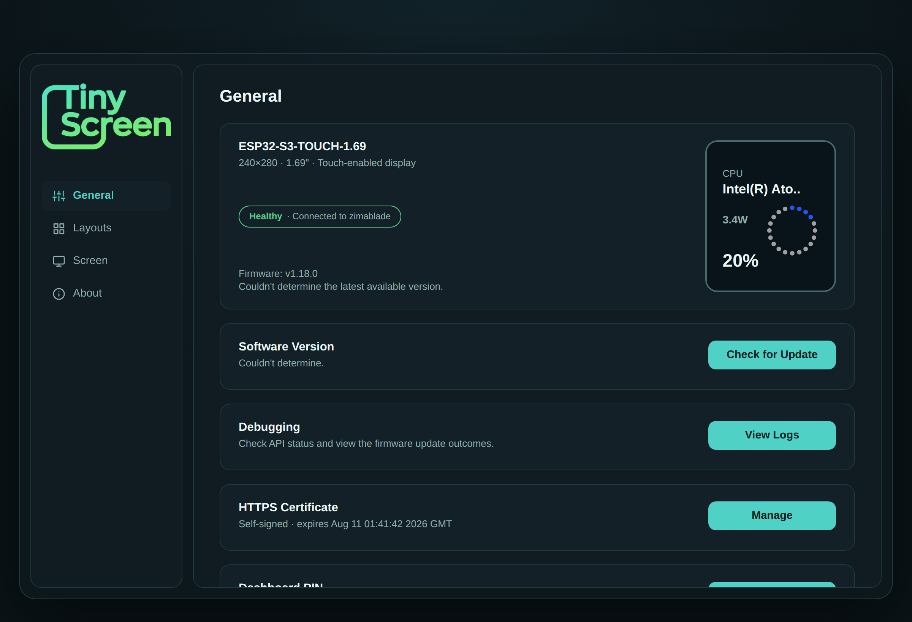
</p>
<p align="center"><em>The dashboard's General tab: device health, firmware, and updates at a glance.</em></p>

<p align="center">
  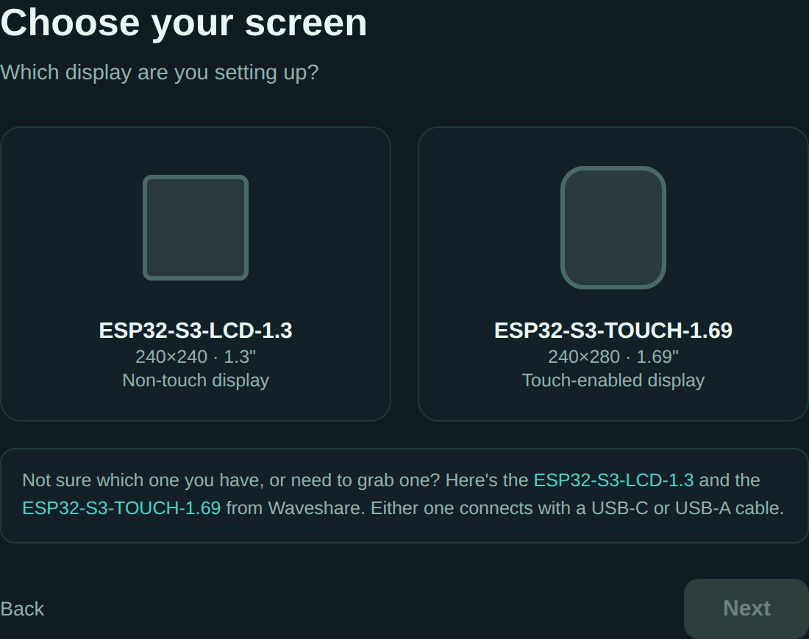
</p>
<p align="center"><em>The first-time setup wizard walking through board selection.</em></p>

##  Screen layouts

Every stat page has a default look plus alternates, picked per-page in
the dashboard's Layouts tab:

| Page        | Layouts                                                 |
| ----------- | ------------------------------------------------------- |
| CPU         | TinyScreen default, ZimaOS Dial, Zima App Ring           |
| RAM         | TinyScreen default, ZimaOS Dial, Zima App Ring           |
| Temperature | TinyScreen default, Zima App Mist (+ animated)           |
| Network     | TinyScreen default, ZimaOS Graph (rolling history), Zima App Bars |
| System disk | TinyScreen default, ZimaOS Drive (with health pill), Zima App Dots |
| NAS pool    | TinyScreen default, ZimaOS Drive (with health pill), Zima App Dots |

The ZimaOS Drive layout shows real drive health: the system eMMC via the
kernel's JEDEC health registers, and SATA/NVMe pool drives via
`smartctl` (bundled in the app image). Health is polled every ten
minutes; when it can't be determined, the pill simply isn't shown.

### Gallery

Every page and style, rendered by the dashboard's live preview:


**CPU Utilization**

<table><tr>
<td align="center">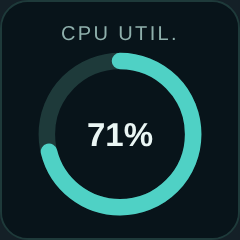<br><sub>TinyScreen (default)</sub></td>
<td align="center">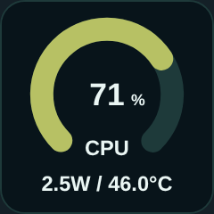<br><sub>ZimaOS Dial</sub></td>
<td align="center">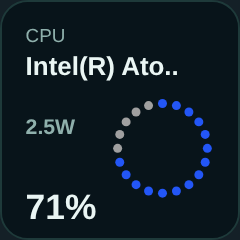<br><sub>Zima App Ring</sub></td>
</tr></table>

**RAM Utilization**

<table><tr>
<td align="center">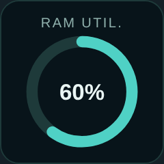<br><sub>TinyScreen (default)</sub></td>
<td align="center">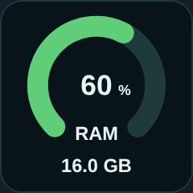<br><sub>ZimaOS Dial</sub></td>
<td align="center">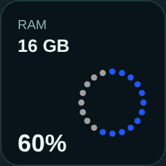<br><sub>Zima App Ring</sub></td>
</tr></table>

**CPU Temperature**

<table><tr>
<td align="center">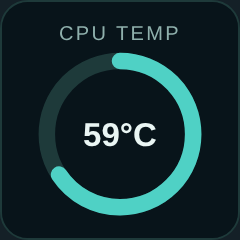<br><sub>TinyScreen (default)</sub></td>
<td align="center">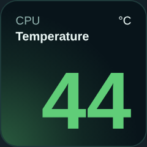<br><sub>Zima App Mist</sub></td>
<td align="center"><br><sub>Zima App Mist (animated)</sub></td>
</tr></table>

**Network Utilization**

<table><tr>
<td align="center">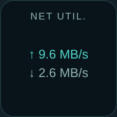<br><sub>TinyScreen (default)</sub></td>
<td align="center">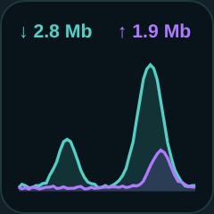<br><sub>ZimaOS Graph</sub></td>
<td align="center">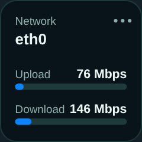<br><sub>Zima App Bars</sub></td>
</tr></table>

**MMC Usage**

<table><tr>
<td align="center">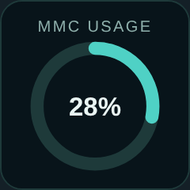<br><sub>TinyScreen (default)</sub></td>
<td align="center">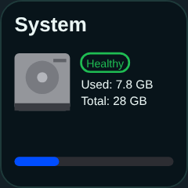<br><sub>ZimaOS Drive</sub></td>
<td align="center">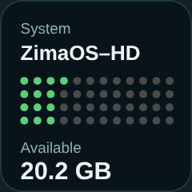<br><sub>Zima App Dots</sub></td>
</tr></table>

**NAS Usage**

<table><tr>
<td align="center">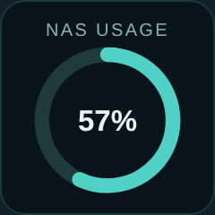<br><sub>TinyScreen (default)</sub></td>
<td align="center">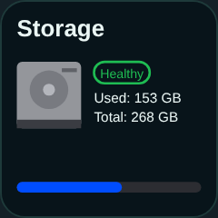<br><sub>ZimaOS Drive</sub></td>
<td align="center">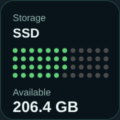<br><sub>Zima App Dots</sub></td>
</tr></table>

##  Repo map

```
zima-tinyscreen/
├── app/                  ZimaOS/Docker packaging: Flask server (HTTP :8989,
│                         HTTPS :8990), collector lifecycle, self-updater,
│                         HTTPS certificate manager
├── collector/            Python stats collector (runs inside the container)
├── firmware/             ESP32-S3 firmware (PlatformIO, C++), incl. generated
│                         fonts in src/tiny_fonts.h
├── firmware_arduino/     Same firmware as an Arduino IDE sketch folder
│                         (kept in sync -- edit firmware/src, then copy)
├── tests/                Host-side test suite (no hardware needed) -- see
│                         "Testing" below
├── tools/genfont.py      Regenerates tiny_fonts.h from DejaVu TTFs
├── webflasher/           wizard.html + dashboard.html + firmware binaries
├── assets/               App icon (ZimaOS tile) and README media
│                         (screenshots, layout gallery, section icons)
├── .github/workflows/    CI: firmware-tree drift guard, all test suites,
│                         both firmware builds, Docker image push
├── RELEASING.md          The release checklist
├── about.json            Content for the dashboard's About tab
├── CHANGELOG.json        Version history shown in the dashboard
└── VERSION               Project version (firmware has its own, in main.cpp)
```

## Install as a ZimaOS app

Installation is a copy-paste of one file into ZimaOS -- no SSH needed.

1. Grab the ready-to-paste compose file:
   [`app/docker-compose.customapp.filled.yml`](app/docker-compose.customapp.filled.yml)
   (open it on GitHub, hit the copy-file button).
2. In ZimaOS, open the **App Store**, click the **+** next to the
   search bar, and pick **Install a customized app**. The settings
   form opens:

<p align="center">
  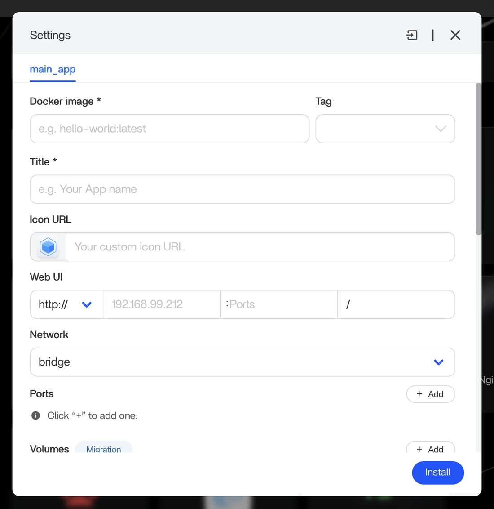
</p>

3. Don't fill it in by hand -- click the **import** icon in the
   dialog's top-right corner and choose **Docker Compose**:

<p align="center">
  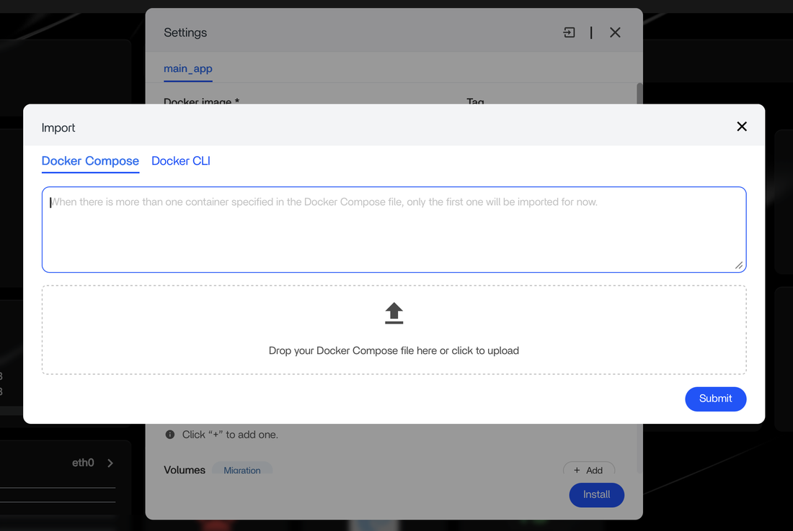
</p>

4. Paste the compose file into the text box (or drop the file itself)
   and hit **Submit**. ZimaOS pre-fills everything -- image, ports,
   volumes, icon, and per-field explanations of what each mount is
   for. Skim the confirmation, click **Install**, and TinyScreen
   appears in your app drawer.

ZimaOS shows a general "please confirm your settings" notice on every
custom-app import; with this compose file there's nothing to change --
everything arrives pre-filled and labeled. For more on custom apps,
see the [ZimaOS documentation](https://www.zimaspace.com/docs/).

The app updates itself afterward: **General -> Check for Update** pulls
the newest image and swaps the container (with automatic rollback if
the new one fails to come up).

##  Flashing and configuring

Plugged into your computer: open `https://<zima-ip>:8990/wizard.html`
(HTTPS matters -- browsers only allow WebSerial on secure origins).
Plugged into the ZimaBlade itself: `http://<zima-ip>:8989/wizard.html`,
which flashes over the server's own serial connection using `esptool` --
no browser APIs involved. Either way, settings changes afterwards happen
in `dashboard.html`.

About that HTTPS warning: the app generates a self-signed certificate on
first start (persisted in AppData so the warning only appears once per
browser). If you'd rather have no warning at all, the dashboard's
**General → HTTPS Certificate** card accepts your own cert (Let's
Encrypt or any CA, PEM). New connections switch to it immediately, and
`/api/upload_cert` also accepts multipart POSTs so a certbot deploy hook
can push renewals automatically. Reverting to self-signed is one click.

##  Building the firmware yourself

Arduino IDE: open `firmware_arduino/zima_tinyscreen/` (folder name must
match the .ino). Remember the CDC-on-boot setting for your board (above).

PlatformIO:

```
cd firmware
pip install platformio
pio run                 # builds both board variants
```

Binaries land in `.pio/build/<env>/`; the webflasher manifests expect
them under `webflasher/firmware/{bridge,native}/`. CI does all of this
automatically -- building locally is only needed for firmware
development.

Fonts: the smooth text comes from GFX fonts generated out of DejaVu Sans
by `tools/genfont.py` into `firmware/src/tiny_fonts.h`. Add sizes or
characters there, rerun it, and copy the header into the Arduino sketch
folder too.

##  The protocol

The collector sends one JSON line per second over USB serial (115200
baud). Current fields:

```
{"cpu_name":"Intel(R) Celeron(R) N5105","cpu_pct":12.3,"cpu_temp_c":45.2,
 "cpu_watts":6.1,"ram_total_gb":15.5,"ram_pct":34.5,
 "mmc_total_gb":28.0,"mmc_pct":61.2,"mmc_label":"ZimaOS-HD","mmc_health":"healthy",
 "nas_available":true,"nas_total_gb":268.0,"nas_pct":5.3,"nas_label":"SSD",
 "nas_health":"healthy","net_rx_mbps":12.4,"net_tx_mbps":3.1,"net_iface":"eth0",
 "utc_min":857,"local_min":557,"hostname":"zimablade","ip":"192.168.1.42"}
```

Units worth knowing: **RAM is GiB** (÷1024³ -- matching how operating
systems report memory, so a 16 GB stick shows as the same 15.5 your OS
says), while **disk capacities are decimal GB** (÷10⁹ -- matching how
ZimaOS and drive vendors label disks). `cpu_watts` comes from Intel RAPL
and is -1 when unavailable; health fields are "healthy" / "warning" /
"critical" / "" (unknown). `local_min` is minutes-since-midnight in the
dashboard-configured time zone, DST-corrected by the collector.
`hostname` and `ip` identify the host for the Hostname & IP
screensaver (the IP is the primary outbound interface's address).

Commands share the same channel -- any line with a `"cmd"` field is a
command, not stats:

```
{"cmd":"set_config","board":1,"pages":["cpu","temp"],"layouts":{"cpu":"ring"},
 "cycle_mode":"auto","cycle_seconds":10,"brightness":80,
 "aspect_mode":0,"saver_enabled":true,"saver_minutes":10,"saver_style":"hostip"}
```

The firmware acks with `{"ack":"set_config","ok":true}` and persists to
NVS. The dashboard (WebSerial) and `server.py`'s `/api/configure`
(direct serial) both speak this same protocol.

##  Security model

Written down so the trust decisions are explicit rather than accidental.

**What this app trusts.** By default, every device on your local
network. There are no accounts; the API is open on ports 8989/8990.
That's the normal posture for a homelab dashboard, and for a display
gadget it's usually the right trade -- but "the LAN" on a home network
includes every family laptop, phone, smart TV, and guest device, so
read on for what that exposes and how to narrow it.

**What's protected even with no PIN.** State-changing requests are
guarded against cross-site attacks: a malicious website open in your
browser cannot drive this API (same-origin/custom-header check on every
POST). Firmware flashing only ever writes the binaries bundled inside
the app image -- there is no endpoint that accepts arbitrary firmware or
an arbitrary update image, so a LAN attacker can annoy you (reflash,
reset, reconfigure the display, swap the TLS certificate) and read your
system stats, but cannot use this API to run their own code.

**The optional PIN** (General tab -> Dashboard PIN) closes the rest:
with it enabled, every state-changing request requires a login (once per
browser, 30 days), and an extra toggle also locks the read-only stats
for households that consider CPU/disk/network numbers sensitive. The
PIN is stored only as a salted pbkdf2-sha256 hash (600k iterations) in
the app's state folder; login is rate-limited (5 wrong guesses locks PIN entry for a
minute, doubling on every consecutive lockout up to an hour, for
everyone -- deliberate, since per-IP limits mean nothing on a flat LAN
-- and each lockout is logged with the source address). Changing or removing the PIN always requires the current
PIN -- itself under the same guess limit -- so a stolen session cookie
alone can't take over the lock, and rotating the PIN signs out every
browser that was logged in under the old one. The dashboard also
refuses to load inside a frame, so a malicious page can't overlay
invisible buttons on a signed-in session. Forgot
it? Delete `auth.json` from the app's state folder (AppData on your
ZimaOS drive): physical access to the machine outranks the PIN, which is
the right hierarchy for a home appliance.

**Why the container is privileged with the Docker socket mounted, and
why that's accepted rather than "fixed."** `/dev` access is needed for
serial hotplug and SMART health data, and the socket is what powers
self-update. We looked at shrinking `privileged` to device-cgroup rules:
SMART needs raw-IO ioctls on block devices and NVMe char devices use
dynamic major numbers, so the rules end up brittle -- and more
importantly, a container holding the Docker socket is root-equivalent on
the host *regardless* of the privileged flag, so dropping the flag would
be cosmetic. The honest statement is: **if this app's process is ever
fully compromised, the host is compromised.** That is exactly why the
PIN exists (it gates every endpoint, raising the bar in front of any
future endpoint bug), why inputs are validated strictly, and why the
dependency set is pinned and small. If your threat model can't accept
that, don't mount the socket -- the app runs fine without it, you just
lose the self-update button.

##  Testing

Everything testable without hardware is tested without hardware:

```
# firmware logic (compiles main.cpp against stub Arduino/GFX/JSON headers)
g++ -std=c++17 -Wall -Wextra -Wno-unused-parameter -I tests/firmware_stubs \
    -o /tmp/fw_test tests/test_firmware_logic.cpp && /tmp/fw_test
# (zero warnings expected -- CI treats the strict flags as the baseline)

# server endpoints (updater, cert manager) and collector health logic
python3 tests/test_updater.py
python3 tests/test_collector_health.py

# exclusive-serial endpoints (/api/flash, /api/configure, /api/reset_device)
# against a pty-pair fake device + fake esptool -- covers the collector
# pause/resume choreography and the real wire protocol
python3 tests/test_serial_endpoints.py

# optional PIN authentication (lifecycle, guard ordering, lockout, on-disk
# hygiene, and that with no PIN set nothing changes at all)
python3 tests/test_auth.py

# dashboard visual states (needs playwright + chromium)
python3 tests/visual_update_card.py
```

What still needs real hardware each round: how things look on the actual
glass (panel gamma differs from any simulation), and physical-USB
behavior (enumeration, bootloader entry, a board actually surviving a
flash) -- the serial *protocol* and the collector pause/resume
choreography around it are now covered by the pty-pair suite above.

##  Customizing the look

Colors live at the top of `firmware/src/main.cpp` (`COL_BG`, `COL_TEAL`,
pure helpers like `rgb565()` / `lerpColor565()`), and each layout is a
self-contained `draw*()` function -- the easiest path to a new look is
copying the closest existing layout, registering it in the layout
whitelist (`handleSetConfig`) and the dashboard's `PAGE_LAYOUTS`, and
drawing. The panel is RGB565 (16-bit); smooth gradients need dithering
-- see the mist layout for the pattern.

##  AI Disclosure

This project was built in close collaboration with an AI assistant
(Anthropic's Claude). The honest division of labor: I set the
direction, made the design calls, created the visual identity, and
did every round of testing on real hardware -- and Claude wrote the
large majority of the code, tests, and documentation across many
iterative releases.

Nothing shipped on trust alone. Every release ran a five-suite test
battery (firmware logic compiled against stub headers with strict
compiler warnings, server endpoints, serial protocol against a fake
device, authentication, collector health), and the parts a test suite
can't see -- how things actually look and behave on the glass -- were
verified by hand, on the physical displays, every round. Some of this
project's best bug hunts worked exactly that way: photographs of the
screen against a diagnostic border, with the AI reading the pixels
and the code side by side until the geometry confessed.

I believe in being transparent about how things are made. This is how
this one was made, and I'm happy with both the process and the
result.

##  About the Author

<!-- Section reserved -- content by the author. -->
